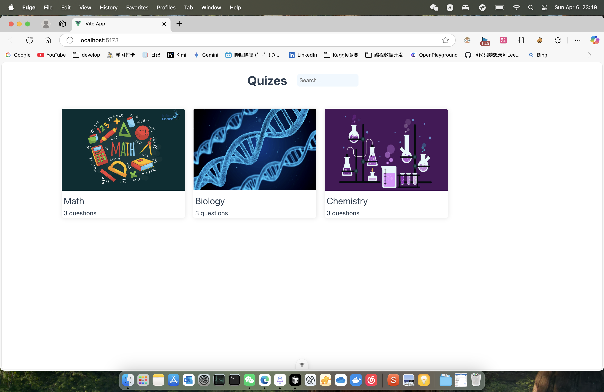

# 03-QuizApp

This template should help get you started developing with Vue 3 in Vite.

## ScreenShot


## Recommended IDE Setup

[VSCode](https://code.visualstudio.com/) + [Volar](https://marketplace.visualstudio.com/items?itemName=Vue.volar) (and disable Vetur).

## Customize configuration

See [Vite Configuration Reference](https://vite.dev/config/).

## Project Setup

```sh
npm install
```

### Compile and Hot-Reload for Development

```sh
npm run dev
```

### Compile and Minify for Production

```sh
npm run build
```

# Quiz App 开发日志

## 2024.4.21 更新
### 完成功能
- ✅ 实现了从主页点击 quiz 卡片跳转到对应的测验页面
- ✅ 完成了问题展示功能
- ✅ 实现了答题功能，可以通过点击选项切换到下一题

### 待办事项 (TODO)
1. 答题结果显示
   - [ ] 在答题结束后显示得分统计
   - [ ] 显示正确题目数量和总题目数量
   - [ ] 添加结果页面的样式设计

2. 导航功能
   - [ ] 添加 "Go Back" 按钮/文字块
   - [ ] 实现返回首页功能
   - [ ] 设计返回按钮的样式

### 技术要点
- 使用 Vue Router 实现页面导航
- 使用 Computed Properties 处理测验数据
- 使用 Props 和 Events 实现组件间通信

### 下一步计划
1. 设计结果展示页面的UI
2. 实现答题记录的存储和统计
3. 优化用户交互体验
4. 添加动画效果增强用户体验
